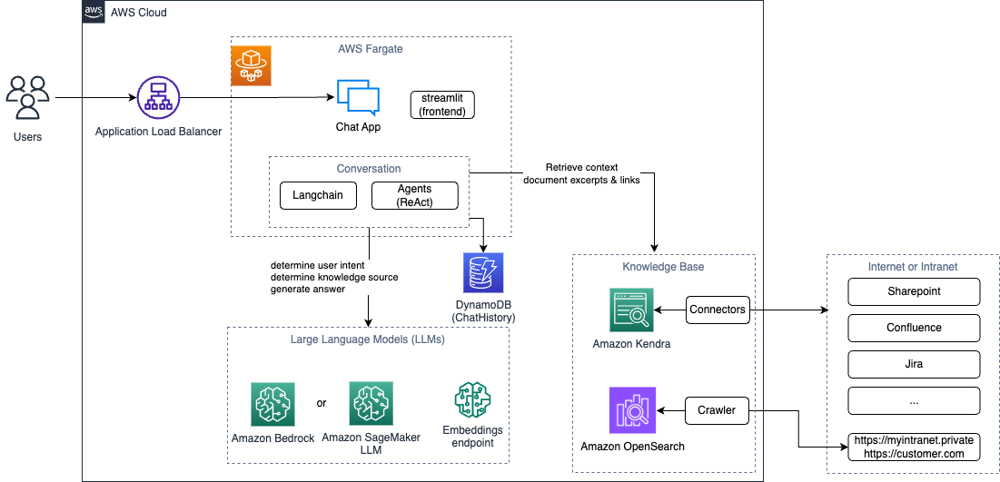

# Gena - Generative Enterprise Assistant <a name="gena---generative-enterprise-assistant"></a>

## Table of contents <a name="table-of-contents"></a>

- [Gena - Generative Enterprise Assistant](#gena---generative-enterprise-assistant)
  - [Table of contents](#table-of-contents)
  - [Intro and Architecture](#introduction)
    - [Architecture Overview](#architecture-overview)
  - [Getting started](#getting-started)
    - [Full deployment](#full-deployment)
    - [Modular Deployment: Deploying individual components](#modular-deployment)
    - [Common Deployment Scenarios](#common-deployment-scenarios)
  - [I need help](#i-need-help)
  - [Usage Scenarios](#usage-scenarios)
    - [How to populate knowledge bases?](#populate-knowledgebase)
    - [How to fine-tune a LLM?](#finetune)
    - [How to customize the chatbot?](#customize-chatbot)
  - [Costs and Clean up ](#costs-and-clean-up)
    - [Costs](#costs)
    - [Clean up](#clean-up)
  - [Setup development environment](#setup-development-environment)
    - [Pull Requests](#pull-requests)
    - [Repository structure](#repo_structure)
    - [Local Development Guide](#local-development-guide)
    - [Pre-requisites for Development](#pre-requisites-for-development)
  - [Troubleshooting/FAQ](#troubleshootingfaq)
  - [Copyright information](#copyright)

## Intro and Architecture <a name="introduction"></a>

Gena is a fully private chat companion which uses retrieval augmented generation (RAG) to augment an LLM conversation with additional knowledge from private knowledge bases.

This solution provides a reference implementation of a dialog-based search bot using the retrieval augmented generation (RAG) approach with interchangeable large language models (LLMs) and knowledge bases (KBs).

It combines intelligent search with generative AI to give factual answers based on the private knowledge base. The search is based on [Amazon OpenSearch Service](https://aws.amazon.com/opensearch-service/) and [Amazon Kendra](https://aws.amazon.com/kendra/) services. The solution also leverages [Streamlit](https://streamlit.io/) for the frontend and [Langchain](https://github.com/hwchase17/langchain) for the conversation flow to implement an interactive chat application.

The core features of this implementation are:

- Fully private Chatbot with generative AI capabilities on private data
- Flexible browser based webcrawler using scrapy and Playwright to download and ingest webpages from public and private sources into the knowledge base, see [full webcrawler feature list](./01_crawler/README.md#crawler)
- Support for different knowledge bases ([OpenSearch](https://aws.amazon.com/opensearch-service/) or [Amazon Kendra](https://aws.amazon.com/kendra/))
- Semantic Search with Amazon Kendra or custom vector embeddings with OpenSearch
- Fine-tuning of LLMs to increase model relevance and quality of answers
- Free choice of different LLMs and search engines
- End-to-end automated deployment using AWS CDK

The following screenshot shows the application user interface:


<div class=“alert alert-info”> 💡 Note: this solution will incur AWS costs. You can find more information about these costs in the Costs section.
</div>

### Architecture Overview <a name="architecture-overview"></a>



## Getting started <a name="getting-started"></a>

We provide infrastructure as code for the solution in [AWS CDK](https://aws.amazon.com/cdk/).

There are two main deployment types:

- [Full deployment](#full-deployment): Deploy all components (stacks) of the solution.
- [Modular deployment](#modular-deployment): Deploy each component (stack) individually.

### Full deployment <a name="full-deployment"></a>

You can deploy all the components (stacks) of the solution at once.

The simplest way is to use Launch Stack (to be added), which uses a cloudformation template to bootstrap a codecommit repo from the github repository and triggers a full deployment using codepipeline.

Alternatively, you can use the next steps to deploy the full solution with CDK.

**Step 1**: Pre-requisites <a name="pre_requisites"></a>

You need the following frameworks on your local computer. You can also use the [AWS Cloud9](https://aws.amazon.com/cloud9/) IDE for deployment and testing.

- Node version 18 or higher
  - [AWS CDK](https://aws.amazon.com/cdk/) version `2.91.0` or higher (latest tested CDK version is `2.91.0`)
- [Python Poetry](https://python-poetry.org/)
- [Docker](https://www.docker.com/)

To install the latest AWS CDK version:

```bash
npm install -g aws-cdk
```

To install `Python Poetry`, or see [poetry installation details](https://python-poetry.org/docs/):

- Linux, macOS, Windows (WSL):
  ```bash
  curl -sSL https://install.python-poetry.org | python3 -
  ```
- Windows (Powershell)
  ```sh
  (Invoke-WebRequest -Uri https://install.python-poetry.org -UseBasicParsing).Content | py -
  ```

To install the project dependencies with poetry:

```sh
poetry install
```

You can review the [CDK Deployment Flow](https://github.com/aws/aws-cdk/wiki/Security-And-Safety-Dev-Guide#:~:text=expects%20to%20exist.-,Deployment%20Flow,-This%20guide%20will) to understand what roles and access rights for each role are being used.
In a nutshell, you can bootstrap CDK using e.g. Administrator access, which creates a set of scoped roles (`cdk-file-publishing-role, cdk-image-publishing-role, cdk-deploy-role, cdk-exec-role`).

You can trigger the deployment through CDK which assumes the file, image publishing and deployment role to initiate the deployment through AWS CloudFormation which then can use the passed `cdk-exec-role` IAM role to create the required resources.

Note that the deployment user does not need to have the rights to directly create the resources.

❗ **By default, this solution deploys the Falcon 40B LLM model on a `ml.g5.12xlarge` compute instance on Amazon SageMaker. Please ensure your account has an appropriate service quotas for this type of instance in the AWS region you want to deploy the solution**

**Step 2:** Deploying with CDK

Clone the GitHub repository:

```sh
git clone <repo-path>.git
```

❗ **Automated deployment is implemented in 06_automation, go to this folder and proceed with other steps:**

```bash
cd <path-to-cloned-repo>/06_automation
```

Change to the infrastructure as code directory and install the dependencies:

```bash
poetry install
poetry shell
```

Make sure your current working directory is `06_automation`.
The following command will check for available stack and deploy the whole solution.
CDK will add the Application Prefix to all stack (**Gena** by default)

```bash
cdk ls
cdk deploy --all --require-approval never
```

The most relevant app configuration parameters are being loaded from the [app config](./06_automation/configs/dev.json)

If required, you can change the used AWS account and region by setting the following env variables:
`export CDK_DEFAULT_ACCOUNT=<your_account_id>`
`export CDK_DEFAULT_REGION=<aws_region>`.

### Modular Deployment: Deploying individual components <a name="modular-deployment"> </a>

You can also deploy individual components only. Gena will automatically detect which components are available based on resource tags (defined in [app config](./06_automation/configs/dev.json)) and use them accordingly. Check [automation readme](./06_automation/README.md) for more details.

The Gena components are:

1. A large language model (LLM).
2. A knowledge base (KB) with a search index over ingested documents. Gena, using the LLM, queries the KB and uses returned documents to enhance the LLM prompt and provide document links in the response. The knowledge base and the search capabilities are provided by Amazon Kendra or Amazon OpenSearch.
3. A Chatbot frontend which orchestrates the conversation with langchain.
4. Sagemaker Studio domain for experimentation

❗ **Gena is default application Prefix, if case you change it make sure to modify the commands below**

**Step 1: Deploying the LLM**  
The solution deploys by default the [Falcon 40b instruct](https://huggingface.co/tiiuae/falcon-40b-instruct) LLM.

```bash
cdk deploy GenaLlmPipelineStack --require-approval never
```

After the deployment is completed, you can navigate to CodePipeline to monitor how the deployment is proceeding (it takes between 10 and 15 minutes).

**Step 2: Deploying the knowledge base**

To deploy the OpenSearch index, follow the instructions below.

```bash
cdk deploy GenaOpenSearchDomainStack GenaOpenSearchIngestionPipelineStack --require-approval never
```

`GenaOpenSearchDomainStack` deploys an OpenSearch domain with Direct Internet Access, protected by an IAM role.
Similarly you can also deploy `GenaOpenSearchIngestionPipelineStack`, which initiates the pipeline that creates a SageMaker real-time endpoint for computing embeddings, and a custom crawler to download the website defined in the [`buildspec.yml`](06_automation/code/llm_setup/buildspec.yml). It also ingests the documents downloaded by the crawler into the OpenSearch domain.

To deploy the Kendra index and data sources, follow the instructions in [Deploying Amazon Kendra](./06_automation/stacks/README.md#deploying-amazon-kendra)\*\*

```bash
cdk deploy KendraIndexStack KendraDataSourcesStack --require-approval never
```

`KendraIndexStack` creates an Amazon Kendra Index and a `WEBCRAWLERV2` data source pointing at the website you specified in the [app config](06_automation/configs/dev.json).
The stack deployment takes about 30 minutes. The crawling and ingestion pipeline can take longer depending on the size of the website, amount of downloaded documents, and the crawler depth you specified.

**Step 3: Deploy the chatbot**

The chatbot requires the following configuration:

- the Sagemaker endpoint name for the embeddings
- the SageMaker endpoint name for the LLM
- the endpoint for the OpenSearch domain
- the index of the OpenSearch to query
- the Kendra index ID

[Optional] Use chatbot with Amazon Bedrock:

- To use Amazon Bedrock you have to update the chatbot according to the **Amazon Bedrock** section in [03_chatbot/README.md](./03_chatbot/README.md#amazon-bedrock).

These configurations are identified by specific resource tags deployed alongside the resources.
The chatbot dynamically detects the available resources based on these tags.
If you want to personalize the chatbot icons, you can do so by updating the configuration in the [./03_chatbot/chatbot/appconfig.json](03_chatbot/chatbot/appconfig.json) file.

```bash
cdk deploy GenaChatBotStack --require-approval never
```

The chatbot UI interface is protected by a login form. The credentials are automatically generated and stored in AWS Secret Manager.
The Streamlit credentials can be retrieved either by navigating in the console to the AWS Secret Manager, or by using the aws cli.

```bash
# username
aws secretsmanager get-secret-value --secret-id streamlit_credentials | jq -r '.SecretString' | jq -r '.username'
# password
aws secretsmanager get-secret-value --secret-id streamlit_credentials | jq -r '.SecretString' | jq -r '.password'
```

By default, we deploy a self-signed certificate to enable encrypted communication between the browser and the chatbot.
The default configuration of the self-signed certificate can be found in [dev.json](./06_automation/configs/dev.json):

```json
{
  ...
  "self_signed_certificate": {
    "email_address": "customer@example.com",
    "common_name": "example.com",
    "city": ".",
    "state": ".",
    "country_code": "AT",
    "organization": ".",
    "organizational_unit": ".",
    "validity_seconds": 157680000 # 5 years validity
  }
}
```

To avoid the self-signed certificate error from the browser, we recommend to deploy your own certificate to the chatbot.
You can import your own certificate to Amazon Certificate Manager, or generate a new one if you have a domain registered into Route 53 and point it to the Application Load Balancer of the Chatbot.

**Step 4: Deploy Sagemaker Studio Domain**
Amazon SageMaker Studio provides an environment where you experiment in the notebooks with different LLMs, embeddings, and fine-tuning.

The solution provides notebooks for experimentation. For example:

- [./00_llm_endpoint_setup/deploy_embeddings_model_sagemaker_endpoint.ipynb](./00_llm_endpoint_setup/deploy_embeddings_model_sagemaker_endpoint.ipynb) to deploy a SageMaker endpoint to help create document embeddings with HuggingFace's Transformers.
- [./00_llm_endpoint_setup/deploy_falcon-40b-instruct.ipynb](./00_llm_endpoint_setup/deploy_falcon-40b-instruct.ipynb) to deploy Falcon 40b Foundation Model, either real-time or asynchronous.

Note than any modification iwhile we think that collaboration is key to success and synergies, we want to make sure that the contributions can be maintained in the future, thus create an issue with the proposed improvements and get feedback before you put in the effort to implement the change the notebooks or the default configuration, needs to be reflected in the [app config](06_automation/configs/dev.json), otherwise the chatbot won't know about these.

```bash
cdk deploy SageMakerStudioDomainStack --require-approval never
```

### Common Deployment Scenarios <a name="common-deployment-scenarios"></a>

The solution is flexible and will [automatically discover the available resources](./03_chatbot/README.md#discovery-of-available-knowledge-bases-and-llms), including Amazon Bedrock models, knowledge bases (Amazon Kendra and Amazon OpenSearch), and available LLM endpoints.
This means you can decide which knowledge base you combine with which LLM. 
If you do not have access to Amazon Bedrock, or if it is not available in the AWS Region of your choice, you need to deploy an LLM on Amazon SageMaker.

The most common scenarios are:

- Amazon Kendra + Large LLM on Amazon SageMaker (Falcon 40B)
- Amazon OpenSearch + Large LLM on Amazon Bedrock (Claude Instant 12K)
- Amazon OpenSearch + Light LLM on Amazon SageMaker (e.g. Falcon 7B)

## I need help <a name="i-need-help"></a>

If you want to report a bug please open an issue in this repository with the _Default bug_ issue template.
Would you like to request a new feature then please open an issue with the _Feature Request_ template.

In case you have a general question or simply need help please open an issue with the _I need Help_ issue template so that we can get in touch with you.

## Usage Scenarios <a name="usage-scenarios"></a>

### How to populate knowledge bases ? <a name="populate-knowledgebase"></a>

You can add knowledge (textual content) by ingesting it to the available knowledge bases.

The main options are:

1. Add additional data sources to Amazon Kendra and run the ingestion
2. Manually add knowledge to Amazon OpenSearch by

- [running the crawler](01_crawler/README.md) and
- [ingesting crawling results](02_ingestion/04_ingest_html_embeddings_to_opensearch.ipynb)

3. Retrigger the ingestion pipeline by changing the codecommit repo created by the `GenaOpenSearchIngestionPipelineStack`.

### How to fine-tune a LLM? <a name="finetune"></a>

An example of LLM fine-tuning is provided in 2 steps for the model Falcon 40B, i.e. the [actual tuning](./04_finetuning/train_llms_with_qlora/fine-tune-falcon.ipynb) and the [deployment of the tuned model](./04_finetuning/deploy_llms_with_qlora/deploy_fine_tuned_falcon.ipynb). 

The fine-tuning is performed using QLoRA, a technique that quantizes a model to 4 bits while keeping the performance of full-precision. This technique enables models with up to 65 billion parameters on a single GPU and achieves state-of-the-art results on language tasks.

The deployment is done using the Hugging Face Text Generation Inference Container (TGI), which enables high-performance using Tensor Parallelism and dynamic batching.

### How to customize the chatbot? <a name="customize-chatbot"></a>

In preparation

## Costs and Clean up <a name="costs-and-clean-up"> </a>

### Costs <a name="costs"> </a>

This solution is going to generate costs on your AWS account, depending on the used modules.
The main cost drivers are expected to be the real-time Amazon SageMaker endpoints and the knowledge base (e.g. Amazon OpenSearch Service, Amazon Kendra), as these services will be always up and running. 

Amazon SageMaker endpoints can host the LLM for text generation, as well as the embeddings model used in combination with Amazon OpenSearch. Their pricing model is based on instance type, number of instances, and time running (billed per second). The default configuration uses (pricing in USD for the Ireland AWS Region as of September 2023):
  - 1 x ml.g5.12xlarge for the LLM ($7.91/hour)
  - 1 x ml.g4dn.xlarge for the embeddings ($0.821/hour)

Note that extra cost may apply when using commercial models through the AWS Marketplace (e.g.: AI21 Labs LLM models).

You can delete the Amazon SageMaker endpoints during non-working hours to pause the cost for the LLM running on the Amazon SageMaker endpoint, or use Asynchronous endpoints. For a pay-per-token pricing model use Amazon Bedrock which bills the number of input and output tokens. This means that, if you do not use the application, there is no cost from the LLM.

With regards to the knowledge bases, you can choose between Amazon Kendra and Amazon OpenSearch Service. [Amazon Kendra pricing model](https://docs.aws.amazon.com/whitepapers/latest/how-aws-pricing-works/amazon-kendra.html) depends on the edition you choose (Developer or Enterprise). The Developer Edition is limited to a maximum of 10,000 documents, 4,000 queries per day, and 5 data sources. If you need more than that or you are running in production you should use the Enterprise Edition.

Amazon OpenSearch Service pricing is based on instance type, number of instances, time running (billed per second), and EBS storage attached. The default configuration uses a single node cluster with 1 x t3.medium.search instance and 100 GB EBS storage (gp2).

Finally, the application relies on an Amazon ECS task running on AWS Fargate and on an Amazon DynamoDB table. AWS Fargate pricing model is based on requested vCPU, memory, and CPU architecture, and billed per second. The default configuration uses 1 vCPU and 2 GB of memory, and uses Linux/x86_64 architecture. The default solution provisions a DynamoDB Standard table with on-demand capacity. DynamoDB pricing dimensions include read and write request units and storage.

Pricing examples of LLM and knowledge base for four scenarios (prices in USD for Ireland AWS Region as of September 2023):

**Amazon Bedrock + Amazon Kendra**
  - See Amazon Bedrock console for model pricing
  - Amazon Kendra Developer Edition: **$810/month**
  - **Monthly total = $810 + Amazon Bedrock cost**

**Work hours Large LLM on Amazon SageMaker + Amazon OpenSearch**
  - Real-time endpoints, 8 hours/day, 20 days/month = 160 hours/month.
  - Endpoint for LLM on 1 x ml.g5.12xlarge: $7.91 x 160 = **$1265.6**
  - Endpoint for embeddings on 1 x ml.g4dn.xlarge: $0.821 x 160 = **$131.36**
  - Amazon OpenSearch Service: t3.medium.search + 100 GB EBS (gp2) = 720 h/month x $0.078/hour + $0.11 GB/hour * 100 GB = **$67.16**
  - **Monthly total = $1265.6 + $131.36 + $67.16 = $1464.12**

**Work hours Large LLM on Amazon SageMaker + Amazon Kendra**
  - Real-time endpoint based on 1 x ml.g5.12xlarge, 8 hours/day, 20 days/month: $7.91 x 8 x 20 = **$1265.6**
  - Amazon Kendra Developer Edition: **$810**
  - Monthly total = $810 + $1265.6 = **$2093.7457**

**Always-on light LLM on Amazon SageMaker + Amazon Kendra**
  - Real-time endpoint based on 1 x ml.g5.4xlarge, 24/7 (720 hours/month): $2.27 x 720 = **$1634.4**
  - Amazon Kendra Developer Edition: **$810**
  - **Monthly total = $810 + $1634.4  = $2462.5457**


| Item                               |                                     Description                                     | Monthly Costs |
| :--------------------------------- | :---------------------------------------------------------------------------------: | ------------: |
| Knowledge Base - Amazon Kendra     |  Developer Edition (maximum of 10,000 documents, 4,000 queries per day, and 5 data sources)      |  810.00 USD  |
| Knowledge Base - Amazon OpenSearch | 1 x ml.g4dn.xlarge for embeddings pluc 1 x t3.medium.search instance with 100 GB EBS storage (gp2) |  198.52 USD |
| Full LLM (Falcon 40B)              | ml.g5.12xlarge (CPU:48, 192 GiB, GPU: 4),<br> 8 hours/day x 20 days x 7.09 USD/hour |  1,134.40 USD |
| Light LLM (Falcon 7B)              |  ml.g5.4xlarge (CPU:16, 64 GiB, GPU: 1),<br> 8 hours/day x 20 days x 2.03 USD/hour  |    324.80 USD |

### Clean up <a name="clean-up"> </a>

To clean up the resources, first you need to delete the SageMaker endpoints created by the two AWS CodePipeline pipelines since they are not managed by CDK.

```bash
aws cloudformation delete-stack --stack-name GenaLLMSageMakerDeployment
aws cloudformation delete-stack --stack-name GenaEmbeddingsSageMakerDeployment
```

Then, you can remove the stacks created by CDK

```bash
cdk destroy --all
```

## Setup development environment<a name="setup-development-environment"></a>

Below you can see the repository structure. We use different environments for each component.
You should follow the [local development guide](#local-development-guide), if you want to provide a pull request.

- How to setup the development environment for the chatbot? <br> Follow the [chatbot Readme](./03_chatbot/README.md).
- How to setup the development environment for the automation project? <br>Follow the [Full Deployment section](#full-deployment).

### Pull Requests <a name="pull-requests"></a>

We appreciate your collaboration because it is key to success and synergies. However, we want to make sure that the contributions can be maintained in the future, thus create an issue with the proposed improvements and get feedback before you put in the effort to implement the change

If you want to contribute a bug fix please use the _Default pull_ request template.

### Repository structure <a name="repo_structure"></a>

1. [00_llm_endpoint_setup](./00_llm_endpoint_setup)
   - Embedding endpoint setup
   - LLM endpoint setup
2. [01_crawler](./01_crawler)
   - Web crawler which downloads content from a public or private web page recursively using `playwright` and [Mozilla's `readability.js` plugin](https://github.com/mozilla/readability). For more details see the [README](./01_crawler/README.md)
3. [02_ingestion](./02_ingestion)
   - Split and Ingestion of the downloaded webpage paragraphs into a vector store (OpenSearch) using semantic embeddings.
4. [03_chatbot](./03_chatbot)
   - Chatbot application based on Streamlit and Langchain
5. [04_finetuning](./04_finetuning)
   - LLM fine-tuning pipelines
6. [05_doc](./05_doc)
   - Solution documentation
7. [06_automation](./06_automation)
   - Infrastructure as code (CDK)

### Local Development Guide <a name="local-development-guide"> </a>

In preparation

### Pre-requisites for Development <a name="pre-requisites-for-development"> </a>

We use Trunk for security scans, code quality, and formatting. If you plan to contribute to this repository please install Trunk.

**Step 1:** Install Trunk

To use `trunk` locally, run:

If you are on MacOS run:

```bash
brew install trunk-io
```

or you are on a different OS or not using Homebrew run:

```bash
curl https://get.trunk.io -fsSL | bash
```

For other installation options and details on exactly Trunk install or how to uninstall, see the [Install Trunk](https://docs.trunk.io/docs/install) doc.

**Step 2:** Initialize Trunk in a git repo

From the root of a git repo, run:

```bash
trunk init
```

See also https://github.com/trunk-io/ for additional information on trunk.

## Troubleshooting/FAQ <a name="troubleshootingfaq"> </a>

In preparation

## Copyright information <a name="copyright"> </a>

Copyright Amazon.com, Inc. or its affiliates. All Rights Reserved.
SPDX-License-Identifier: MIT-0
